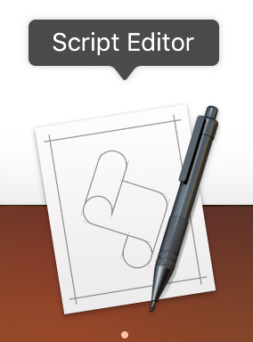

This "txt" has the the AppleScript code.

You could past it to the "Script Editor" and run

 

Like this

Or you can use the "Script Editor" to save it as an application. So you can just click and run it.