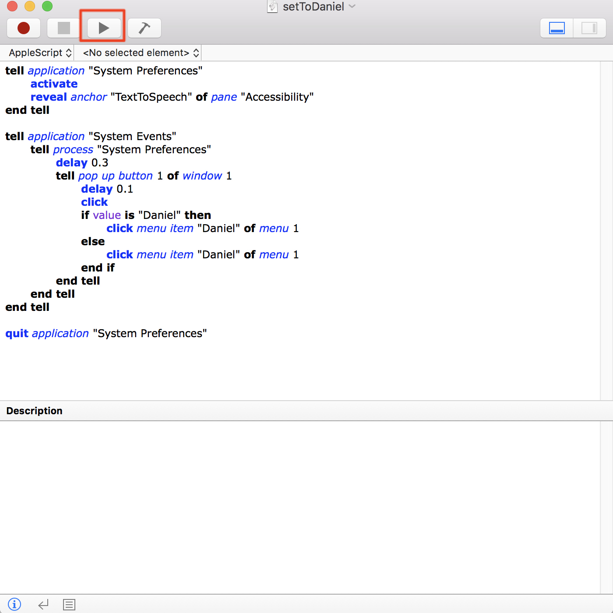

This "setToDaniel"(YES! Actually, it is a txt without the ".txt") has the the AppleScript code.

You could past it to the "Script Editor" and run

 

Like this. And, you can run it automatically.

Someone may could not run it, for the reason "You did not allow the the Script Editor to control your computer".

You could set it in System Preferences => Security&Privacy => Privacy. And click the checkbox on the "Script Editor". 

You can also use the "Script Editor" to save it as an application. So you can just click and run it (you should also allow the applications to CONTROL YOUR COMPUTER).